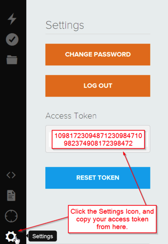

# PIXIE
## Firmware
After having [installed](https://www.polidea.com/blog/PIXIE_-_continuous_integration_status_light-4/) our beautiful PIXIE, you want to have it up and running! First thing you have to do is to setup your Particle device. In order to do that you should follow the instructions available on [Particle website]. When the device is connected to the network you can install our firmware. Here is a list of steps that have to be done:

1. Download the [firmware](https://github.com/Polidea/PIXIE/blob/master/firmware.bin)
2. Put your device into [listening mode]
3. Run [particle setup] command from command line and remember the name that you've given to your device
4. Log in to [Particle build site] using credentials defined in previous step and copy the *AccessToken*<br>
  
5. Make sure that the device is [connected] to WiFi (it should slowly blink cyan)
6. Run following command from command line:
```sh
$ particle flash DEVICE_NAME /PATH_TO_FIRMWARE/firmware.bin
```
7. Wait until the device is [connected] to WiFi again (slowly blinking cyan)

Now the device is running our firmware and it's connected to your WiFi network. In order to show build status you have to set the endpoints that will return your build statuses for each USB ports.
Our firmware has 4 remote functions that allows you to do that: `setPort1Url` `setPort2Url` `setPort3Url` and  `setPort4Url`
You can call these functions by making an http request. Here is an example using [curl]:

```sh
$ curl https://api.particle.io/v1/devices/DEVICE_NAME/setPortXUrl \
    -d access_token=ACCESS_TOKEN  \
    -d "args=http://YOUR_URL"
```
Where:
- *DEVICE_NAME* is the name of your device that you've specified during setup
- *setPortXUrl* is one of 4 remote functions available in our firmware
- *ACCESS_TOKEN* is the token taken from [Particle build site]
- *YOUR_URL* is the url to your endpoint that returns build status for a specific project

Note: *YOUR_URL* **can not be longer than 63 characters!**

###License
**PIXIE** is released under a MIT License. See LICENSE file for details.

[Particle website]: https://docs.particle.io/guide/getting-started/connect/photon/
[listening mode]: https://docs.particle.io/guide/getting-started/modes/photon/#listening-mode
[particle setup]: https://docs.particle.io/guide/tools-and-features/cli/photon/#particle-setup
[Particle build site]: https://build.particle.io/
[connected]: https://docs.particle.io/guide/getting-started/modes/photon/#connected
[curl]: https://curl.haxx.se/
